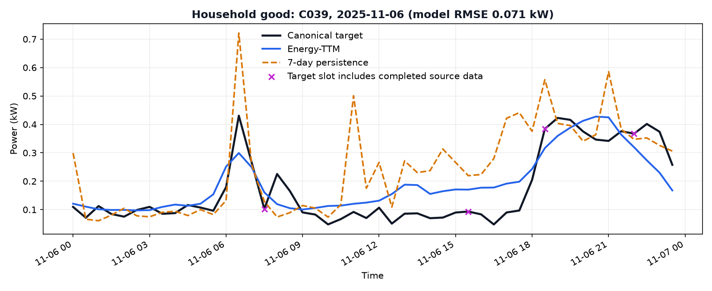
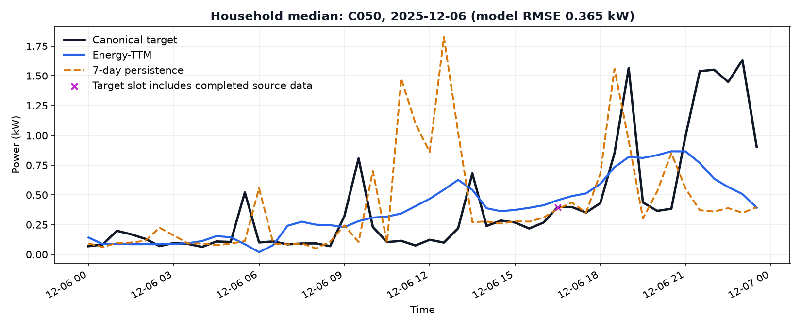
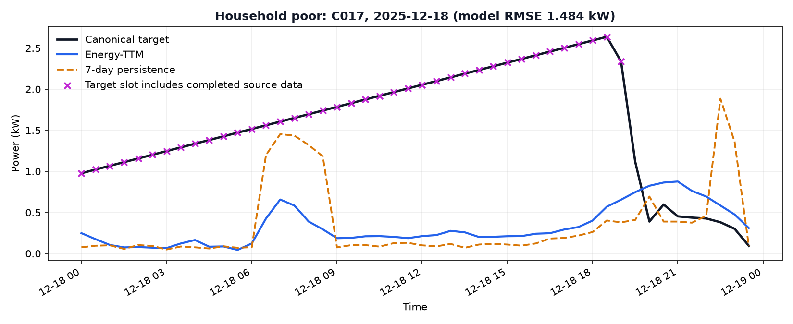
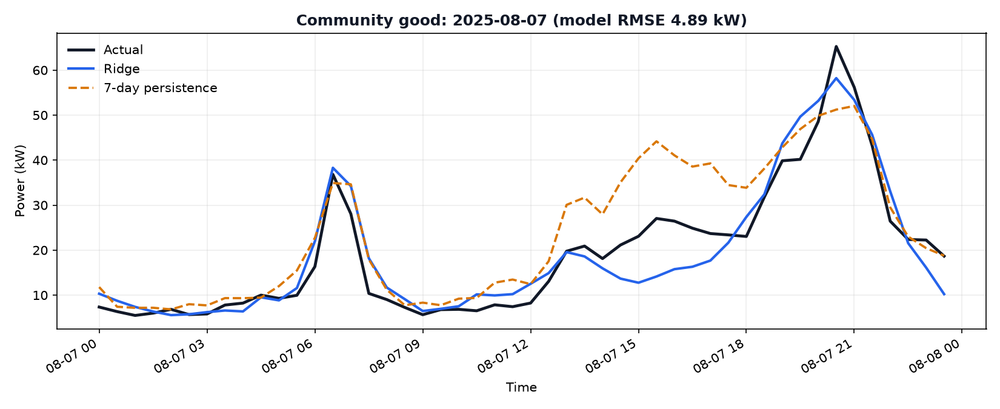
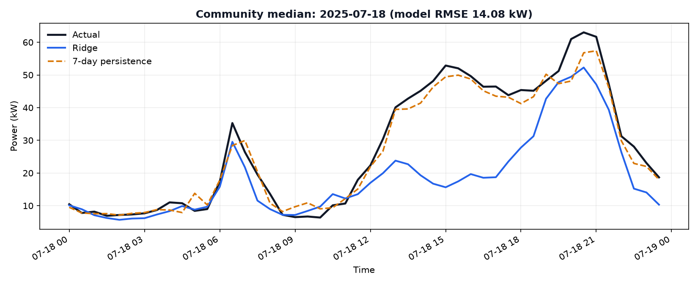
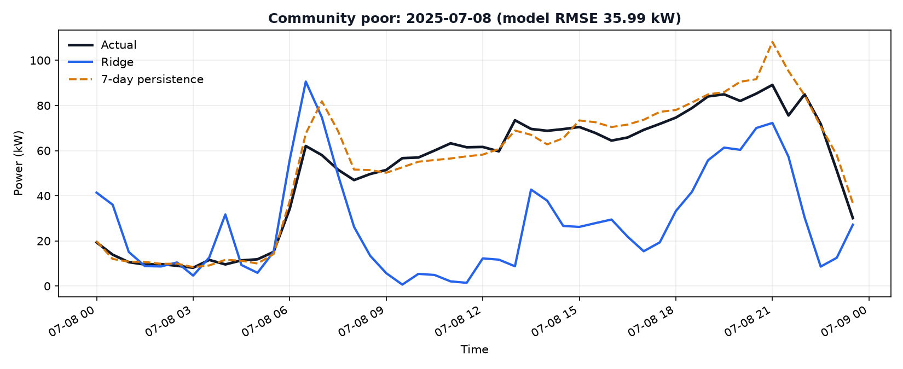

# Forecasting Model Training and Performance Audit

Audit date: 2026-10-08  
Scope: saved household Energy-TTM model and saved community Ridge profile model  
Constraint observed: no model was replaced or retrained during this audit.

## Executive conclusion

The household model **was genuinely fine-tuned on the v3 household data**. It is not merely an untouched downloaded checkpoint. The training script loads `EnergyFM/energy-ttm`, randomly reinitializes the resized 48-sample patcher and 48-step output head, and optimizes every parameter. Reconstructing the adapted pretrained initialization with the recorded seed and comparing it with the saved artifact showed changes in all 278 comparable tensors (30,610 parameters), including all 274 tensors outside the resized input/head layers. The saved artifact SHA-256 is `5fa42561cc885d1d75a036c8f55aa782b90b11bd3254dbb85232cdd71bf62140`.

The notebooks did **not** perform this fine-tuning. They load Energy-TTM for zero-shot forecasting. The fine-tuning provenance comes from `scripts/train_forecasting.py`, its metadata/history, artifact timestamps, and the direct weight comparison. The `fit()` found in the backtesting notebook belongs to a random-forest DR classifier, not to Energy-TTM.

The community model was also genuinely fit on v3, independently of the household model. It is a deterministic 48-output Ridge model, not Energy-TTM. Its fitted non-zero coefficients and saved train-only scalers are present in `models.joblib` (SHA-256 `3138cbb6d73ed848c3b29f48b2801a0a9ebc434db0baab8f311253907150863e`).

The predictions are unsatisfactory for different reasons:

- Household Energy-TTM improves average MAE, RMSE, WAPE, and daily-energy absolute error over seven-day persistence, but both methods are weak on appliance-scale shape and timing. Energy-TTM WAPE is 65.62%, mean absolute peak timing error is 409 minutes, and it systematically under-predicts the daily peak by 0.875 kW on average. Its global univariate design has no household identity, calendar, weather, occupancy, or appliance-state inputs; the adapted model compresses each 24-hour patch into a small representation, which favors a smooth typical profile over irregular appliance events.
- Community demand Ridge is worse than persistence on MAE, RMSE, and WAPE and wins only 20 of 62 test days. It is strongly regularized, trained only through May, tested in July/August, and has no forecast-temperature input. It under-predicts test energy by 170.85 kWh/day on average, consistent with missing summer/heat information and seasonal underfit.
- The household experiment has a material data-quality limitation: it trained and evaluated against canonical household files completed with whole-series, two-sided interpolation before splitting. All 3,050 test contexts contain at least one completed source minute, 2,701 test targets contain completed values, and 11 test origins have a missing final pre-origin minute whose interpolation necessarily uses a post-origin observation. This makes the reported test result partly synthetic and slightly optimistic; it does not explain the poor forecasts away.

## 1. Provenance

### 1.1 Household forecast

| Item | Verified result |
|---|---|
| Architecture | `TinyTimeMixerForPrediction` / Energy-TTM |
| Base checkpoint | `EnergyFM/energy-ttm` |
| Initialization | Pretrained mixer weights; resized patcher (24→48) and output head (24→48) reinitialized due to shape mismatch |
| Operational shape | 336 half-hours (7 days) → 48 half-hours (1 day), one channel |
| Patch geometry | patch length 48, stride 48, seven daily patches |
| Saved network config | 3 encoder mixer layers at `d_model=16`; 8 decoder layers at `decoder_d_model=8`; dropout 0.3, head dropout 0.2; MSE loss; internal standard scaling enabled |
| Parameters compared | 30,610 in 278 same-shaped saved tensors |
| Parameters updated | 30,610; 278/278 tensors changed, including 274/274 core tensors |
| Optimizer | AdamW, learning rate 0.001, weight decay 0.0001, gradient clipping 1.0 |
| Training | 5 epochs, batch size 64, CPU, seed 42; all model parameters passed to the optimizer |
| Saved selection | Best validation-loss state; epoch 5 |
| Canonical source files | `data/households_1min_C001_C025.parquet`; `data/households_1min_C026_C050.parquet` |
| Households | C001–C050 |
| Train | 2025-01-08 through 2025-09-30; 13,300 daily windows |
| Validation | 2025-10-01 through 2025-10-31; 1,550 daily windows |
| Test | 2025-11-01 through 2025-12-31; 3,050 daily windows |
| Scaler | No saved global scaler; each origin uses mean/std from its 336 historical values only |

The artifact and history were written together at `2026-10-08T12:35:29Z`; the metadata records `trained_at_utc=2026-10-08T12:35:29.776528Z`. The metadata file was later amended by evaluation, which accounts for its later filesystem timestamp. These facts establish a coherent saved run. However, the training process did not create an immutable run manifest binding source-code commit, input hashes, history, and final checkpoint hash. Therefore this is the **most recent evidenced run**, not cryptographic proof that no later unlogged run ever occurred.

Weight-level evidence is in `outputs/forecast_audit/household_weight_comparison.csv` and `outputs/forecast_audit/audit_evidence.json`.

### 1.2 Training curves

| Epoch | Train loss | Validation loss |
|---:|---:|---:|
| 1 | 1.487674 | 0.678115 |
| 2 | 1.404971 | 0.660949 |
| 3 | 1.384138 | 0.654153 |
| 4 | 1.367616 | 0.654193 |
| 5 | 1.358491 | 0.652229 |

Validation loss does not turn upward, so there is no training-curve evidence of overfitting. It was still improving slightly at epoch 5, which is evidence that training had not clearly converged. Validation loss being below training loss is plausible because the configured model uses dropout during training; it is not evidence of leakage by itself.

### 1.3 Community forecast

| Item | Verified result |
|---|---|
| Architecture | Separate multi-output Ridge regressors for demand, STEG, and PV; 48 outputs each |
| Initialization | Fit from scratch; no pretrained weights |
| Features | 203: recent 48 slots ending D-1 13:30, D-2, D-7, mean D-8…D-2, weekday one-hot, month sin/cos, holiday, Ramadan |
| Source file | `data/original_v3_backup/grid_1min.csv` |
| Households | No household IDs; community demand is the grid's aggregate household-consumption series (the synthetic community represents the 50 households) |
| Train | 2025-01-09 through 2025-05-31 |
| Validation | 2025-06-01 through 2025-06-30 |
| Test | 2025-07-01 through 2025-08-31 |
| Demand counts/alpha | 121 train, 27 validation; alpha 100 |
| STEG counts/alpha | 143 train, 30 validation; alpha 1 |
| PV counts/alpha | 126 train, 30 validation; alpha 100 |
| Scaling | One `StandardScaler` per target, fitted only on its training matrix and saved inside `models.joblib` |

Demand intervention days are excluded from demand training/validation. Supply models retain them. The fitted demand coefficient matrix is 48×203 with 9,744 non-zero coefficients, so this is not an empty/default artifact.

## 2. Pipeline audit

### 2.1 Aggregation, units, and alignment

- Household source power is watts. `operational_household()` converts W to kW and takes the arithmetic mean within each 30-minute interval. It does not sum power.
- Energy is derived as `kW × 0.5 h`, producing kWh per half-hour. Training targets, inverse scaling, dashboard KPIs, and held-out metrics use this conversion correctly.
- The household input is exactly the 336 timestamps from D-7 00:00 through D-1 23:30. The target is D 00:00 through D 23:30. `build_window()` reindexes to those timestamps, rejects duplicate timestamps, and refuses incomplete operational contexts/required targets.
- Training and Streamlit both call the same `operational_household()`, `build_window()`, and `normalize_context()` functions. Both inverse-transform with the context mean/std. The dashboard loads the same default artifact directory that was evaluated.
- The model also has Energy-TTM's internal scaling enabled. This is redundant with the outer context standardization, but it occurs in both training and inference and is not a training/inference mismatch.
- Community issuance is D-1 14:00. Its recent feature window ends at 13:30, and all lag profiles precede issuance. Forecast timestamps are the 48 half-hours of D and align with the actual series.

No kW/kWh inversion, horizon shift, scaler mismatch, or Streamlit artifact-path mismatch was found.

### 2.2 Missing-data completion and leakage

The household training source is not the untouched parquet. The canonical parquets were produced from backups using two-sided timestamp interpolation. The manifest records 56,586 completed aggregate-power minutes in C001–C025 and 49,439 in C026–C050. The longest aggregate gaps were 4,320 and 1,918 minutes respectively. Valid original measurements were preserved, but interpolated labels are not measurements.

Impact by model split, counted against the original backup:

| Split | Missing source minutes completed | Affected 30-min household slots | Fully missing source slots | Target windows affected | Context windows affected |
|---|---:|---:|---:|---:|---:|
| Train | 78,291 | 29,755 | 1,495 | 11,786 / 13,300 | 13,300 / 13,300 |
| Validation | 7,716 | 3,575 | 129 | 1,389 / 1,550 | 1,550 / 1,550 |
| Test | 17,976 | 6,858 | 344 | 2,701 / 3,050 | 3,050 / 3,050 |

Two-sided interpolation is not automatically a causal violation when both bracketing observations precede the forecast origin. A direct origin-crossing check found 54 train, 8 validation, and 11 test origins where the final source minute before midnight was missing; completing that minute necessarily uses an observation at or after the forecast origin. Those 73 contexts contain direct future information. In addition, interpolated test targets make the evaluation reference partly estimated.

The household resampler itself has no coverage threshold: `mean()` will retain a slot when even a subset of its minutes is present, and only an all-missing slot becomes NaN. Because the canonical training files contain no remaining aggregate-power NaNs, it produces complete operational windows. This is internally consistent but hides original coverage from the learner.

The community pipeline deliberately differs: it reads the original pre-completion grid, retains per-slot coverage, and discards a slot below 80% source-minute coverage. In the July/August test period no demand/STEG/PV slot fell below 80%; 21 demand slots and 15 PV slots were partially covered (minimum 29/30 minutes) and no STEG slot was partial. Thus the community held-out metrics do not depend on two-sided interpolation.

### 2.3 Split and leakage verdict

- Target-day splits are chronological and disjoint.
- Allowing a validation/test context to contain earlier train/validation observations is normal rolling-origin evaluation, not leakage.
- Household scaling is fitted per origin using context only.
- Community scalers are fitted on train only.
- No future target values enter the explicit household feature builder or community feature builder.
- **Confirmed leakage limitation:** preprocessing the full household year with two-sided interpolation before splitting introduced 73 direct origin-crossing cases and made most target days partly estimated.
- No ground-truth DR savings or future DR labels are forecast features.

## 3. Held-out prediction quality

Metrics below are means of per-day metrics. Peak magnitude and timing “error” are absolute; signed values are reported separately as bias. Earlier artifacts mislabeled signed peak offsets as errors. The evaluator and regression test were corrected during this audit and all held-out outputs were regenerated without training.

### 3.1 Individual households — 50 households, 3,050 windows

| Method | MAE kW | RMSE kW | WAPE | Daily energy bias kWh | Daily energy absolute error kWh | Peak magnitude absolute error kW | Peak magnitude bias kW | Peak timing absolute error min |
|---|---:|---:|---:|---:|---:|---:|---:|---:|
| Energy-TTM | 0.2472 | 0.3865 | 65.62% | +0.2739 | 2.0790 | 0.9121 | -0.8747 | 409.0 |
| 7-day persistence | 0.2787 | 0.5052 | 73.98% | -0.3699 | 2.5593 | 0.7018 | -0.0809 | 382.9 |

Energy-TTM beats persistence on daily RMSE in 2,617/3,050 windows (85.8%) and on mean RMSE for all 50 households. This is real improvement, but not adequate peak/appliance forecasting: the model is worse than persistence on both peak magnitude and peak timing, and its large negative peak bias shows smoothing.

Representative held-out cases selected by Energy-TTM RMSE:

| Case | Household/date | Energy-TTM RMSE | Persistence RMSE | Target slots touching completed source data |
|---|---|---:|---:|---:|
| Good | C039, 2025-11-06 | 0.0706 kW | 0.1435 kW | 4 / 48 |
| Median | C050, 2025-12-06 | 0.3655 kW | 0.5699 kW | 1 / 48 |
| Poor | C017, 2025-12-18 | 1.4838 kW | 1.5364 kW | 39 / 48 |

The magenta crosses in these plots identify canonical target slots containing one or more completed source minutes. In particular, the long straight ramp in the poor case is largely interpolation, not observed appliance behavior; it demonstrates why the current test set cannot be treated as fully measured ground truth.

### 3.2 Community aggregate — 62 held-out days

Demand is reported separately from supply components, as required.

| Demand method | MAE kW | RMSE kW | WAPE | Daily energy bias kWh | Daily energy absolute error kWh | Peak magnitude absolute error kW | Peak timing absolute error min |
|---|---:|---:|---:|---:|---:|---:|---:|
| Ridge | 12.6283 | 16.1587 | 38.50% | -170.8482 | 192.3153 | 10.0362 | 169.8 |
| 7-day persistence | 10.9758 | 13.9016 | 36.97% | +29.3697 | 231.3366 | 14.1296 | 106.9 |

Ridge wins daily demand RMSE on only 20/62 days (32.3%). It improves absolute daily-energy and peak-magnitude error but loses the main slot-level metrics and peak timing.

For completeness, the separate aggregate supply forecast performs better than its baseline:

| Supply method | MAE kW | RMSE kW | WAPE | Daily energy absolute error kWh |
|---|---:|---:|---:|---:|
| Ridge STEG+PV | 4.9157 | 5.7593 | 4.58% | 96.6520 |
| 7-day persistence | 6.9464 | 7.8224 | 6.51% | 155.6969 |

Representative community-demand cases:

| Case | Date | Ridge RMSE | Persistence RMSE |
|---|---|---:|---:|
| Good | 2025-08-07 | 4.8900 kW | 7.4457 kW |
| Median | 2025-07-18 | 14.0796 kW | 3.3001 kW |
| Poor | 2025-07-08 | 35.9899 kW | 6.8699 kW |

## 4. Diagnosis

| Hypothesis | Finding | Evidence |
|---|---|---|
| Model not trained on v3 | Rejected | All household core tensors differ from seeded adapted checkpoint; v3 files/splits and loss history exist. Community Ridge has fitted coefficients/scalers. |
| Training/inference mismatch | Rejected for current saved model | Same artifact path, aggregation, windowing, context normalization, inverse scaling, and 336→48 contract are used. |
| Incorrect kW/kWh or inverse scaling | Rejected | W→kW before averaging; kWh = kW×0.5; inverse transform uses origin context mean/std. |
| Incorrect horizon/alignment | Rejected | Context ends D-1 23:30; output/actual start D 00:00 for 48 slots. |
| Overfitting | Not supported | Validation loss generally decreases through epoch 5; no late validation degradation. |
| Underfitting / excessive smoothing | Supported | Household peak bias -0.875 kW and 409-minute timing error; community demand loses to baseline and has large summer energy underprediction. |
| Insufficient training | Plausible, not proven causal | Only five epochs and validation loss was still improving. A longer run must be selected by validation, not assumed better. |
| Insufficient temporal/exogenous features | Strongly supported | Household model is univariate with no calendar/weather/occupancy/household ID. Community has no archived forecast temperature and trains only through spring before a summer test. |
| Inappropriate architecture | Supported for spike objectives | Seven 48-slot patches plus a small latent width encourage daily-profile smoothing; the training loss is MSE, not peak-aware. |
| Naturally unpredictable appliance behavior | Supported | Household peaks are much worse than average-load metrics, including versus persistence; unobserved appliance state/occupancy dominates short events. |
| Missing-data completion effects | Confirmed limitation | All test contexts and 88.6% of test targets touch completed data; 11 test contexts directly cross origin. This likely makes metrics optimistic and smooths peaks. |

## 5. Confirmed bugs fixed during the audit

1. `forecast_metrics()` previously returned signed peak timing under the name `peak_timing_error_minutes`; averaging could cancel early and late errors. It now returns absolute error plus `peak_timing_bias_minutes`.
2. Peak magnitude had the same labeling/cancellation problem. It now returns absolute `peak_magnitude_error_kw` plus `peak_magnitude_bias_kw`.
3. Absolute daily-energy error is now recorded separately from signed daily-energy bias.
4. Community validation reporting flattened multiple days before computing energy/peak metrics, making those daily statistics meaningless. The training script now retains global slot metrics while computing daily energy/peak statistics per validation day. No model was retrained.

`tests/test_forecasting.py` includes a regression test that verifies absolute timing error and signed direction separately. Household and community held-out evaluation artifacts were regenerated by inference only.

## 6. Recommended corrections, in order

1. **Rebuild the experiment from missing-aware source data.** Preserve a minute/slot observation mask; use a documented minimum-coverage threshold; exclude fully missing target slots from loss and metrics; never use two-sided interpolation across an origin. Evaluate separately on wholly observed and partly completed days.
2. **Make provenance immutable.** Save the source hashes, code commit, full command/config, checkpoint hash, scaler hash, package versions, split-date hashes, and best-epoch selection in one run manifest. Do not let evaluation rewrite training metadata.
3. **Keep persistence as an operational gate.** Do not deploy a learned model for a target unless it beats the same-origin seasonal baseline on validation metrics that match the use case.
4. **Improve household inputs before increasing complexity.** Add known-at-origin weekday/holiday/Ramadan/season information, household static attributes or embeddings, and archived weather forecasts if available. Treat appliance/peak prediction as a probabilistic or event-aware task rather than optimizing only mean squared profile error.
5. **Tune Energy-TTM with early stopping.** Compare patch sizes shorter than 48 slots, learning rates, frozen-versus-full fine-tuning, and more epochs using validation only. Report multiple seeds. Do not select on the November/December test period.
6. **Correct the community seasonal regime.** Use rolling/expanding-origin training, archived day-ahead temperature forecasts, and a Ridge/persistence ensemble. The July/August holdout must remain untouched during selection.
7. **Separate objectives.** Continue reporting household forecasts independently from community demand and supply. Track slot accuracy, daily energy, peak magnitude, and peak timing without allowing signed biases to cancel absolute errors.

## 7. Reproduction and audit artifacts

- Run household inference evaluation: `python scripts/evaluate_forecasting.py`
- Run community inference evaluation: `python scripts/evaluate_dr_detection.py`
- Recreate weight evidence and plots without fitting: `python scripts/audit_forecasting.py`
- Run regression tests: `python -m pytest tests/test_forecasting.py -q`
- Detailed evidence: `outputs/forecast_audit/audit_evidence.json`
- Selected cases: `outputs/forecast_audit/selected_cases.csv`
- Weight-by-weight comparison: `outputs/forecast_audit/household_weight_comparison.csv`

The final answer is therefore: **yes, the household Energy-TTM is genuinely fine-tuned on v3, and the community Ridge is genuinely fit on v3.** Poor predictions are not caused by an untrained artifact or a Streamlit scaling/unit bug. They are primarily caused by underfit/smoothed univariate household forecasts for irregular appliance behavior, missing exogenous and household-specific information, a short fine-tuning run that had not clearly converged, and—for community demand—a spring-to-summer regime shift without temperature forecasts. Whole-series household interpolation weakens the validity of the reported experiment and must be corrected before any new model comparison is trusted.
